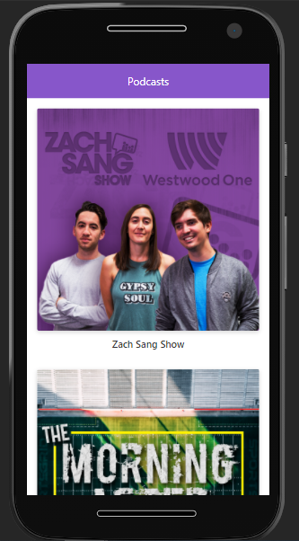

# App de Podcasts

App de podcasts integrada con el API de AudioBoom para aprender Next Js.

## ¿Cómo funciona?

Requiere Node.JS 10

* `npm install` para instalar las dependencias
* `npm run dev` para iniciar el entorno de desarrollo
* `npm run build && npm start` para iniciar el entorno de producción

## Licencia

MIT